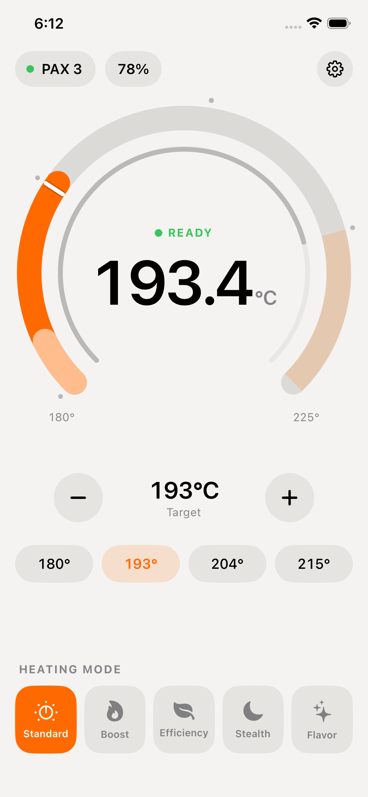
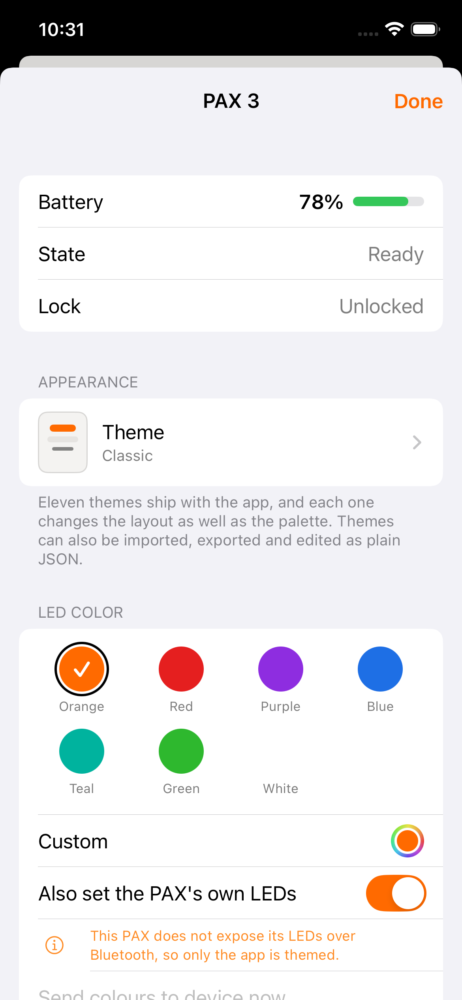
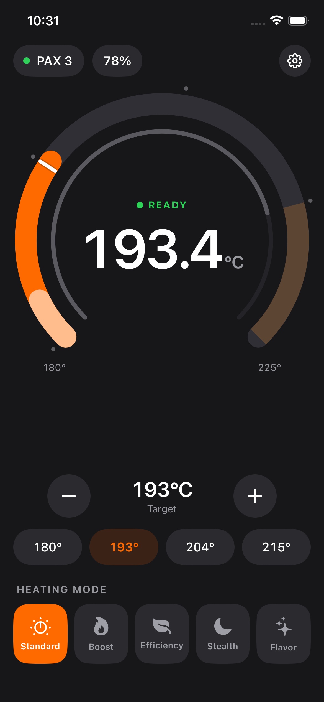
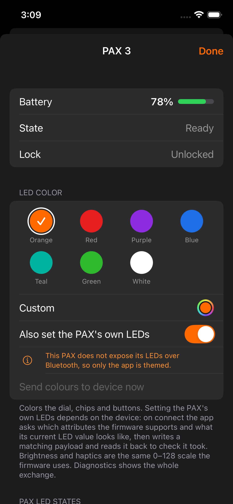

# P3 VapeControl

<!-- screenshots:start -->

<div align="center">

<table>
<tr><td align="center"><b>Control</b></td><td align="center"><b>Settings</b></td></tr>
<tr><td align="center"><picture><source media="(prefers-color-scheme: dark)" srcset="screenshots/01-control-dark.png"></picture></td><td align="center"><picture><source media="(prefers-color-scheme: dark)" srcset="screenshots/02-device-dark.png"></picture></td></tr>
</table>

</div>

<details>
<summary align="center"><b>Light / dark</b></summary>

<div align="center">

<table>
<tr><td align="center"><b>Control</b></td><td align="center"><b>Settings</b></td></tr>
<tr><td align="center"><picture><source media="(prefers-color-scheme: dark)" srcset="screenshots/01-control.png"></picture></td><td align="center"><picture><source media="(prefers-color-scheme: dark)" srcset="screenshots/02-device.png"></picture></td></tr>
</table>

</div>

</details>

<!-- screenshots:end -->

A personal-use iOS app to monitor and control a PAX 3 vaporizer over Bluetooth. Built with SwiftUI + CoreBluetooth.

> **Disclaimer**: Independent personal tool. Not affiliated with, endorsed by, or connected to PAX Labs. PAX® is a registered trademark of PAX Labs. This app contains no PAX branding, logos, or proprietary assets.

https://buymeacoffee.com/selfmeister

---

## Install Guide (no technical experience needed)

### What you need

- A **Mac** running macOS 13 or later
- **Xcode** (free, from the Mac App Store — it's a large download, ~10 GB, give it time)
- An **iPhone or iPad** with Bluetooth, running iOS 16 or later
- A **free Apple ID** (the one you already use for the App Store is fine)
- A **PAX 3**

---

### Step 1 — Download the app code

1. Go to **[https://github.com/selfmeister/P3-VapeControl](https://github.com/selfmeister/P3-VapeControl)**
2. Click the green **Code** button → **Download ZIP**
3. Open the downloaded ZIP — it will create a folder called `P3-VapeControl-main` on your Mac (usually in Downloads)

---

### Step 2 — Open in Xcode

1. Open the `P3-VapeControl-main` folder
2. Double-click **`PaxController.xcodeproj`** — Xcode will open

---

### Step 3 — Sign in with your Apple ID

Xcode needs your Apple ID to install apps on your own phone. This is free and does not require a paid developer account.

1. In Xcode, open the menu: **Xcode → Settings → Accounts**
2. Click the **+** button at the bottom left → **Add Apple ID**
3. Sign in with your regular Apple ID and password

---

### Step 4 — Set your signing team

1. In Xcode, click on **PaxController** in the left sidebar (the top blue icon)
2. In the main area, click on the **PaxController** target under "TARGETS"
3. Click the **Signing & Capabilities** tab
4. Under **Team**, click the dropdown and select your name / Apple ID
5. Xcode will automatically handle the rest

> If you see a bundle identifier error, just change `me.personal.PaxController` to something unique like `com.yourname.paxcontroller` in the Bundle Identifier field.

---

### Step 5 — Connect your iPhone

1. Plug your iPhone into your Mac with a USB cable
2. Unlock your iPhone and tap **Trust** if prompted
3. In Xcode, click the device selector at the top (it may say "Any iOS Device" or a simulator name)
4. Select your iPhone from the list

---

### Step 6 — Build and run

1. Press **⌘R** (or click the ▶ Play button in the top left of Xcode)
2. Xcode will build the app and install it on your phone — this takes a minute the first time
3. The app will launch on your iPhone automatically

---

### Step 7 — Trust the app on your iPhone

The first time you run a sideloaded app, iOS will block it until you trust it:

1. On your iPhone, go to **Settings → General → VPN & Device Management**
2. Tap your Apple ID under "Developer App"
3. Tap **Trust "your Apple ID"** → Confirm

Now open the app — it's ready to use.

> ⚠️ The app must be built from a Mac with Xcode. It cannot run in the iOS Simulator because Bluetooth is not available there.

---

## Using the App

The app is a single screen: a temperature dial. Everything that is not
temperature lives behind the two buttons in the top bar.

### Connecting to your PAX 3

1. **Power on your PAX 3** — press and hold the button until it vibrates
2. Open the app and tap the **connection capsule** in the top left
3. Scanning starts automatically — your PAX 3 should appear within a few seconds
4. Tap **Connect** next to your device

The capsule's dot shows the connection at a glance: green connected, amber
working, red failed, grey idle.

### Reading the dial

- The **filled arc** is the oven's current temperature, climbing from 180 °C at
  the bottom left to 215 °C at the bottom right
- The **white marker** is the target
- The **four dots** are the presets: 180 °C · 193 °C · 204 °C · 215 °C
- The **centre** shows the live temperature and the heating state
  (Off / Standby / Heating / Ready / Cooling / Boost)

### Setting Temperature

Three ways, all writing the same `HeaterSetPoint` (`0x02`):

- **Drag the dial** — one packet is written when you lift your finger, not during the drag
- **− / +** — one degree at a time
- **Preset capsules** — 180 °C · 193 °C · 204 °C · 215 °C

### Heating mode

The row along the bottom sets the PAX 3 dynamic mode: Standard, Boost,
Efficiency, Stealth or Flavor.

### Settings and diagnostics

The **gear** opens a sheet with battery, heating state, lock state, °C/°F,
serial and firmware — and, in debug builds, the packet log, which traces every
Bluetooth packet sent and received.

---

## Troubleshooting

| Problem | Solution |
|---------|----------|
| Device not found during scan | Make sure PAX is powered on and not already connected to another app |
| Temperatures show `--` | Reopen the gear sheet, or reconnect — the app requests a full status on connect |
| "No team" error in Xcode | Complete Step 3 and 4 above — sign in with your Apple ID |
| "Could not launch" on iPhone | Complete Step 7 — trust the developer certificate |
| Build fails: CommonCrypto not found | In Xcode Build Settings, verify `SWIFT_OBJC_BRIDGING_HEADER` points to `PaxController/Sources/PaxController-Bridging-Header.h` |
| App crashes immediately | Use a real device, not the Simulator |

---

## Safety

This app only reads device telemetry and sets the heater temperature. It does
**not** touch firmware, disable thermal limits, or override any safety cutoffs.

The dial runs from 180 °C to 225 °C and marks everything past 215 °C — where the
official app stops — because plant material scorches somewhere around there and
you should be able to see where you are. The device's own `HeaterRanges` table
reports a ceiling of 245 °C; the app deliberately does not offer it.

No data leaves your device. No network requests are made.

---

## Architecture (for developers)

```
PaxController/
├── Sources/
│   ├── PaxControllerApp.swift          Entry point (@main)
│   ├── PaxProtocol.swift               UUIDs, message types, AES crypto, packet codec
│   ├── BluetoothManager.swift          CoreBluetooth central + link statistics
│   ├── PaxDeviceViewModel.swift        Device state, the polling loop, every command
│   ├── ContentView.swift               Root view + sheet presentation
│   ├── ControlView.swift               The one screen: dial, presets, modes
│   ├── TemperatureDial.swift           Draggable thermostat dial
│   ├── DialMotion.swift                The dial's animation state and colours
│   ├── DesignSystem.swift              Layout tokens + temperature formatting
│   ├── LedColor.swift                  Device LED colours and the app's own palette
│   ├── AppSettings.swift               Everything persisted in UserDefaults
│   ├── DeviceSheet.swift               Status, units, device info, diagnostics
│   ├── SessionHistoryView.swift        Recorded sessions and charges
│   ├── SessionCharts.swift             The charts behind that screen
│   ├── PaxSession.swift / PaxCharge.swift   What the app records itself
│   ├── PaxProfile.swift / ProfilesView.swift  Saved temperature + mode presets
│   ├── PaxIntents.swift                App Intents, Shortcuts and Siri
│   ├── LiveActivityController.swift    The Lock Screen card's lifecycle
│   ├── PaxSharedState.swift            The App Group snapshot the widget reads
│   ├── PhoneLink.swift                 WatchConnectivity, phone side
│   ├── LinkStats.swift / LinkBenchmark.swift  How fast the link actually runs
│   ├── LinkSpeed.swift                 That measurement, on screen
│   ├── DebugConsoleView.swift          In-app BLE log viewer
│   └── PaxController-Bridging-Header.h CommonCrypto bridge
├── LiveActivity/                       Lock Screen card + Home Screen widget
├── Tests/                              Protocol and activity-state unit tests
└── Resources/
    └── Info.plist                      Bluetooth permission strings

PaxWatch/                               watchOS companion
```

- **`BluetoothManager`** — CoreBluetooth runs on a dedicated serial queue, not the
  main one, so a notify-to-read turnaround never waits behind SwiftUI animating
  the dial. Only the parsed result hops to the main actor.
- **`PaxProtocol.swift`** — fully isolated: all crypto, UUIDs, message types, packet encode/decode
- **Encryption** — AES-128 ECB (key derivation) + AES-128 OFB (packet encryption) via CommonCrypto bridging header
- **Polling** — a closed loop rather than a timer: the reply to one request is
  what sends the next, so it runs at exactly the rate the link sustains. Two
  requests stay in the air while the oven is working, one while it is idle.
- **Colour** — one orange accent fixed in `LedColor.swift`'s `Brand`, shared by
  the app, the widget, the Live Activity and the watch. The LED colour you pick
  for the device no longer re-themes the interface.
- **No SPM/CocoaPods dependencies**
